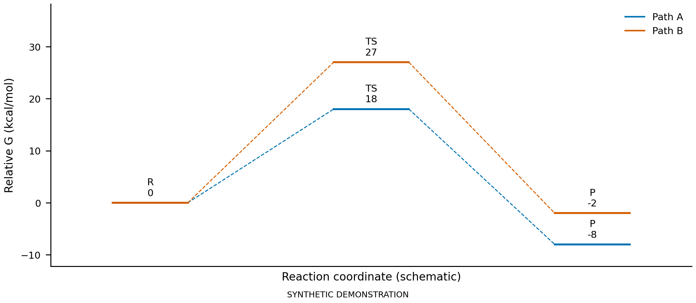
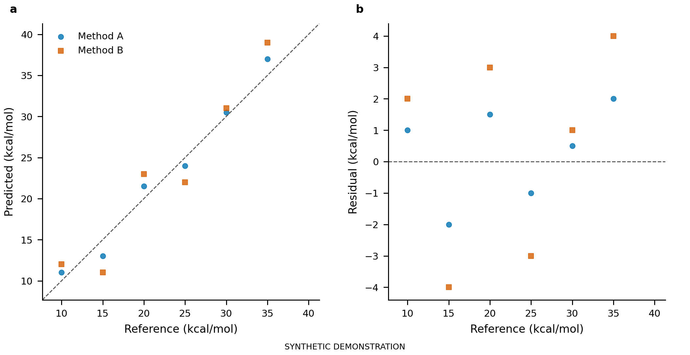
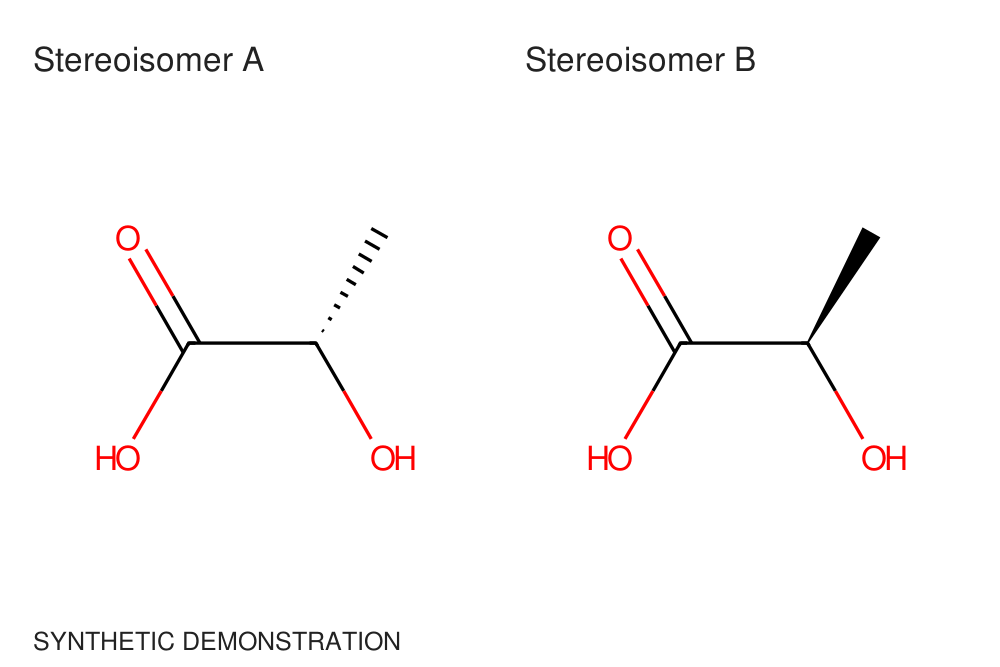

# Original figure examples

All numerical data and chemical examples here are synthetic demonstrations, not HERMES results.
The scripts generate publication-size pages; the previews below are displayed at browser size.
Source specifications live in the skill so installed copies can use the same examples.

| Example | Specification | Preview |
|---|---|---|
| Energy profile | [JSON](../../skills/jacs-figure/assets/examples/energy.json) | [PNG](energy.png) |
| Parity and residuals | [JSON](../../skills/jacs-figure/assets/examples/parity.json) | [PNG](parity.png) |
| Stage accounting | [JSON](../../skills/jacs-figure/assets/examples/stages.json) | [PNG](stages.png) |
| Paired comparison | [JSON](../../skills/jacs-figure/assets/examples/comparison.json) | [PNG](comparison.png) |
| Workflow | [JSON](../../skills/jacs-figure/assets/examples/workflow.json) | [PNG](workflow.png) |
| Stereochemical structures | [JSON](../../skills/jacs-figure/assets/examples/structures.json) | [PNG](structures.png) |
| TOC concept | [JSON](../../skills/jacs-figure/assets/examples/toc.json) | [PNG](toc.png) |








Regenerate a complete PDF/SVG/PNG/spec/caption/QA bundle from the repository root:

```bash
uv run --locked --group figures --group chemistry python skills/jacs-figure/scripts/plot_figures.py skills/jacs-figure/assets/examples/energy.json --output local/energy
```

Change the example name for another family. TOC also exports TIFF; color, grayscale and line
art use distinct raster resolutions. Choose output dimensions for the actual manuscript.
The structure example depicts opposite configurations in two dimensions and makes no claim
about optimized geometry. A clean mechanical report still requires visual and scientific review.
