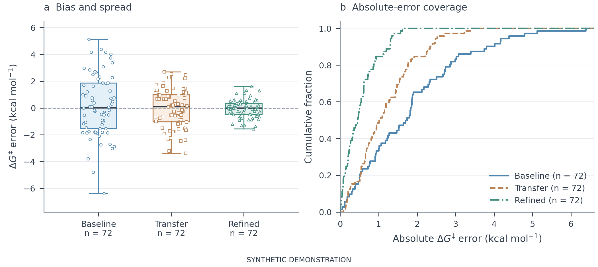
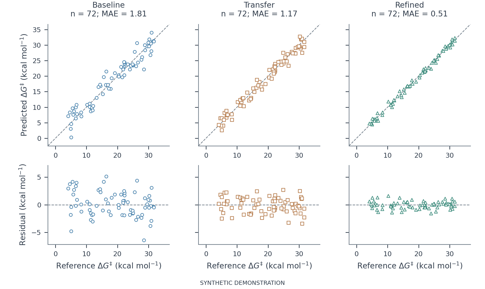
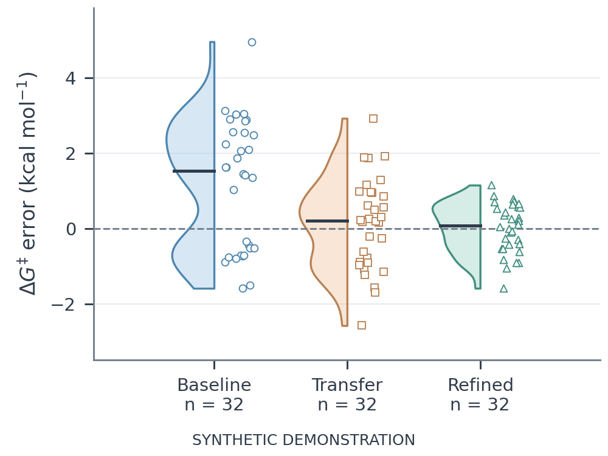
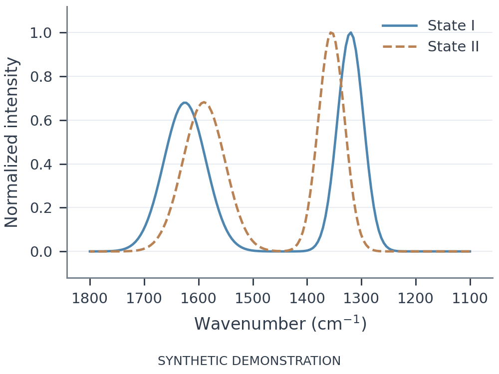
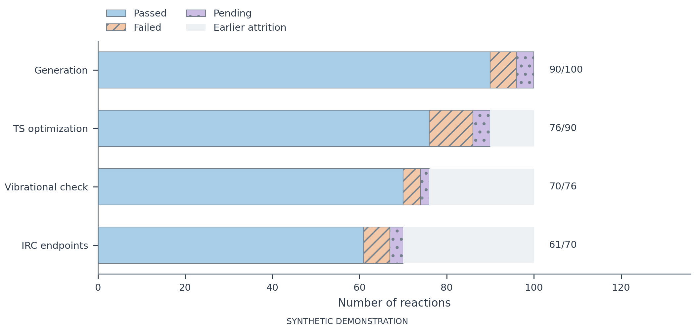

# 以问题组织证据的科研图示例 · v0.4

17 幅原创示例，全部是**合成演示，不是研究结果**。v0.4 修复图注定义丢失、重叠点、密集散点、缺失编码和组图组织问题。
每张预览都附可直接阅读的图注；完整 PDF、SVG、PNG、规格、源哈希和 QA 可重跑生成。

## 同一反应总体的两个问题



[SVG](showcase.svg) · [完整图注](showcase.caption.txt) · [JSON](../../skills/jacs-figure/assets/examples/showcase.json)

两个面板均使用同一批 72 个合成反应与三个示意预测器：a 展示有符号误差的偏差和离散程度，
b 展示绝对误差不超过给定阈值的比例。原始观测均保留，图注说明箱须、n、差值方向和显示变换。
原生坐标轴共同排版，不再把无关的统计示例拼成研究主图。

## 图库与数据规格

| 图型 | 可复现规格 | 矢量 | 预览 | 图注 |
|---|---|---|---|---|
| 箱线图 + 原始点 | [JSON](../../skills/jacs-figure/assets/examples/boxplot.json) | [SVG](boxplot.svg) | [PNG](boxplot.png) | [TXT](boxplot.caption.txt) |
| 小提琴 + 中位数 | [JSON](../../skills/jacs-figure/assets/examples/violin.json) | [SVG](violin.svg) | [PNG](violin.png) | [TXT](violin.caption.txt) |
| 经验累积分布 | [JSON](../../skills/jacs-figure/assets/examples/ecdf.json) | [SVG](ecdf.svg) | [PNG](ecdf.png) | [TXT](ecdf.caption.txt) |
| 共享分箱直方图 | [JSON](../../skills/jacs-figure/assets/examples/histogram.json) | [SVG](histogram.svg) | [PNG](histogram.png) | [TXT](histogram.caption.txt) |
| 点与区间 | [JSON](../../skills/jacs-figure/assets/examples/intervals.json) | [SVG](intervals.svg) | [PNG](intervals.png) | [TXT](intervals.caption.txt) |
| 学习曲线 + SD 带 | [JSON](../../skills/jacs-figure/assets/examples/learning.json) | [SVG](learning.svg) | [PNG](learning.png) | [TXT](learning.caption.txt) |
| 逆向光谱坐标 | [JSON](../../skills/jacs-figure/assets/examples/spectra.json) | [SVG](spectra.svg) | [PNG](spectra.png) | [TXT](spectra.caption.txt) |
| 热图 + 显式缺失 | [JSON](../../skills/jacs-figure/assets/examples/heatmap.json) | [SVG](heatmap.svg) | [PNG](heatmap.png) | [TXT](heatmap.caption.txt) |
| 一致性散点 + 残差 | [JSON](../../skills/jacs-figure/assets/examples/agreement.json) | [SVG](agreement.svg) | [PNG](agreement.png) | [TXT](agreement.caption.txt) |
| 能量剖面 | [JSON](../../skills/jacs-figure/assets/examples/energy.json) | [SVG](energy.svg) | [PNG](energy.png) | [TXT](energy.caption.txt) |
| 小样本 parity | [JSON](../../skills/jacs-figure/assets/examples/parity.json) | [SVG](parity.svg) | [PNG](parity.png) | [TXT](parity.caption.txt) |
| 分阶段去向 | [JSON](../../skills/jacs-figure/assets/examples/stages.json) | [SVG](stages.svg) | [PNG](stages.png) | [TXT](stages.caption.txt) |
| 配对观测比较 | [JSON](../../skills/jacs-figure/assets/examples/comparison.json) | [SVG](comparison.svg) | [PNG](comparison.png) | [TXT](comparison.caption.txt) |
| 流程示意 | [JSON](../../skills/jacs-figure/assets/examples/workflow.json) | [SVG](workflow.svg) | [PNG](workflow.png) | [TXT](workflow.caption.txt) |
| 二维立体化学结构 | [JSON](../../skills/jacs-figure/assets/examples/structures.json) | [SVG](structures.svg) | [PNG](structures.png) | [TXT](structures.caption.txt) |
| TOC 概念图 | [JSON](../../skills/jacs-figure/assets/examples/toc.json) | [SVG](toc.svg) | [PNG](toc.png) | [TXT](toc.caption.txt) |

## 更多预览









## 复现与使用

从仓库根目录运行：

```bash
uv sync --locked --group figures --group chemistry
uv run --locked --group figures --group chemistry python scripts/build_figure_gallery.py
```

完整输出在忽略的 `local/figure-v4/gallery/`。`--publish` 把原创 PNG/SVG 和图注更新到本目录，
同时重置 visual_review 为待检查；图变更后必须重新看图，不能沿用旧验证结论。
单图可用技能中的 `plot_figures.py` 及 JSON；改变 `data_status` 不能把合成数据变成真实数据。

```bash
uv run --locked --group figures python skills/jacs-figure/scripts/plot_figures.py skills/jacs-figure/assets/examples/boxplot.json --output local/my-boxplot
uv run --locked --group figures python skills/jacs-figure/scripts/preview_color.py local/my-boxplot.png --output-dir local/color-review
```

TOC 同时导出 TIFF。结构例子只显示二维立体化学，不代表优化几何。
机械检查和实际视觉检查的边界见[新版验证记录](../../evaluation/figure-v4/REPORT.md)。
[图型选型](../../skills/jacs-figure/references/chart-catalog.md)、[淡亮配色](../../skills/jacs-figure/references/color-design.md)与
[标签／字号／尺度／排版](../../skills/jacs-figure/references/labels-layout-scale.md)给出选择依据。

## 兼容性与范围

旧 SVG 组图输入需为每个 panel 提供 `caption` 或 `caption_file`，以免组合后丢失定义。
新增 `panel_grid` 用于原生数据面板，复杂或不等面积布局仍可采用自定义科学绘图代码。
有符号误差与绝对误差按问题选择；光谱示例明确按各曲线的采样峰值归一，并保留 `raw_y`。
热图的八个示意摘要值保持原样，没有补造样本量或缺失原因。能级图仍是离散能级教程，
正式化学论证需要作者提供结构和条件。示例种类与程序通过数量不代表审美偏好实验。
